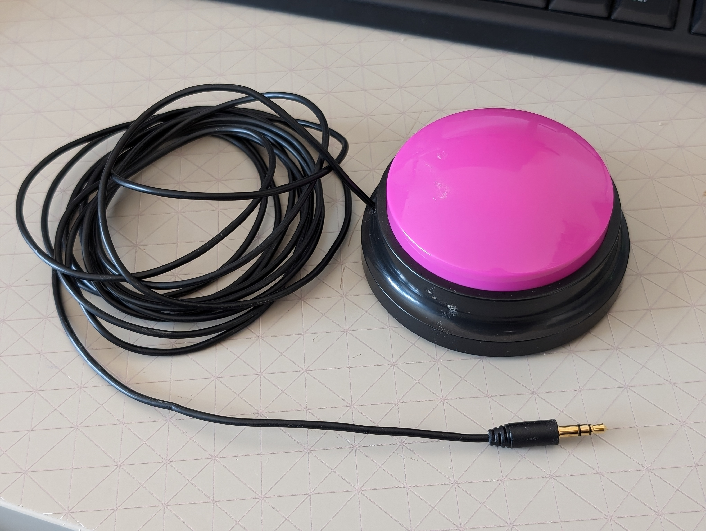

<!--- 
Open Source Assistive Technology: GitHub Readme Template
 --->

<!---
INSTRUCTIONS
This is a markdown template for creating the README.md file in a GitHub repository. This file is rendered and displayed automatically when someone visits the repository.

This document includes helper text that will not be displayed when rendered. Any text between the less-than sign + exclamation mark + three hyphen-minus (<!---) and matching three hyphen-minus + greater-than sign will not be displayed. This helper text can be deleted once the corresponding section is completed.

 --->
 
 <!--- 
TITLE
Should match the name of the GitHub repository. Choose something descriptive rather than whimsical. 
 --->
 
 # Playback Switch

<!--- 
SUMMARY
A brief summary of the project. What it does, who it is for, how much it costs.
 --->

The Playback Switch is an assistive switch that also plays a prerecorded message up to 30 seconds long when the button is pressed. It has a diameter of 90mm and an activation force of roughly 250 grams. The switch is made entirely with commercial, off the shelf parts, with no 3D printing involved. It has a similar functionality to the BIGmack and LITTLEmack buttons. This device is intended for users of assistive switches who would benefit from or prefer additional audio feedback when using a switch.

The device is comprised of off-the-shelf electronics and 3D printed parts. The overall cost of materials is about $8 (plus $8 for component shipping).

The current version of the device (v1.0) has been built and user tested.

Makers Making Change Assistive Device Library Listing: https://www.makersmakingchange.com/s/product/Playback-Switch/01tJR000003S43lYAC

## How to Obtain the Device
### 1. Do-it-Yourself (DIY) or Do-it-Together (DIT)

This is an open-source assistive technology, so anyone is free to build it. All of the files and instructions required to build the device are contained within this repository. Refer to the Maker Guide below.

### 2. Request a build of this device

You may also submit a build request through the [MMC Library Page](https://www.makersmakingchange.com/s/product/Playback-Switch/01tJR000003S43lYAC) to have a volunteer maker build the device. As the requestor, you are responsible for reimbursing the maker for the cost of materials and any shipping.

### 3. Build this device for someone else

If you have the skills and equipment to build this device, and would like to donate your time to create the device for someone who needs it, visit the [MMC Maker Wanted](https://makersmakingchange.com/maker-wanted/) section.

## Build Instructions

### 1. Read through the Maker Guide

The [Maker Guide](/Documentation/Playback_Switch_Maker_Guide.pdf)  contains all the necessary information to build this device, including tool lists, assembly instructions, and testing.

### 2. Order the Off-The-Shelf Components

The [Bill of Materials](/Documentation/Playback_Switch_BOM.xlsx) lists all of the parts and components required to build the Playback Switch. 

### 3. Assemble the Playback Switch

Reference the Assembly Guide section of the [Maker Guide](/Documentation/Playback_Switch_Maker_Guide.pdf) for the tools and steps required to build each portion.

## How to improve this Device
As open source assistive technology, you are welcomed and encouraged to improve upon the design. 

## Files
### Documentation
| Document             | Version | Link |
|----------------------|---------|------|
| Design Rationale     | 1.0     | [Playback_Switch_Design_Rationale](/Documentation/Playback_Switch_Design_Rationale.pdf)     |
| Maker Guide          | 1.0     | [Playback_Switch_Maker_Guide](/Documentation/Playback_Switch_Maker_Guide.pdf)     |
| Bill of Materials    | 1.0     | [Playback_Switch_Bill_of_Materials](/Documentation/Playback_Switch_BOM.xlsx)     |
| User Guide           | 1.0     | [Playback_Switch_User_Guide](/Documentation/Playback_Switch_User_Guide.pdf)    |
| Changelog            | 1.0     | [Playback_Switch_Changelog](CHANGES.txt)     |

## License
Copyright (c) 2024 Neil Squire / Makers Making Change.

This repository describes Open Hardware:
 - Everything needed or used to design, make, test, or prepare the Playback Switch is licensed under the [CERN 2.0 Weakly Reciprocal license (CERN-OHL-W v2) or later](https://cern.ch/cern-ohl ) .
 - All software is under the [GNU General Public License v3.0 (GPL-3.0)](https://www.gnu.org/licenses/gpl.html).
 - Accompanying material such as instruction manuals, videos, and other copyrightable works that are useful but not necessary to design, make, test, or prepare the Playback Switch are published under a [Creative Commons Attribution-ShareAlike 4.0 license (CC BY-SA 4.0)](https://creativecommons.org/licenses/by-sa/4.0/) .

You may redistribute and modify this documentation and make products using it under the terms of the [CERN-OHL-W v2](https://cern.ch/cern-ohl).
This documentation is distributed WITHOUT ANY EXPRESS OR IMPLIED WARRANTY, INCLUDING OF MERCHANTABILITY, SATISFACTORY QUALITY AND FITNESS FOR A PARTICULAR PURPOSE.
Please see the CERN-OHL-W v2 for applicable conditions.

Source Location: https://github.com/makersmakingchange/Playback-Switch

## Attribution

### Contributors
Designers:
 - Brad Wellington

 Testers:
  - Derrick Andrews

---

## About Makers Making Change

Makers Making Change is a program of [Neil Squire](https://www.neilsquire.ca/), a Canadian non-profit that uses technology, knowledge, and passion to empower people with disabilities.

Makers Making Change leverages the capacity of community based Makers, Disability Professionals and Volunteers to develop and deliver affordable Open Source Assistive Technologies.

 - Website: [www.MakersMakingChange.com](https://www.makersmakingchange.com/)
 - GitHub: [makersmakingchange](https://github.com/makersmakingchange)
 - Twitter: [@makermakechange](https://twitter.com/makermakechange)
 - Instagram: [@makersmakingchange](https://www.instagram.com/makersmakingchange)
 - Facebook: [makersmakechange](https://www.facebook.com/makersmakechange)
 - LinkedIn: [Neil Squire Society](https://www.linkedin.com/company/neil-squire-society/)
 - Thingiverse: [makersmakingchange](https://www.thingiverse.com/makersmakingchange/about)
 - Printables: [MakersMakingChange](https://www.printables.com/@MakersMakingChange)

### Contact Us
For technical questions, to get involved, or to share your experience we encourage you to [visit our website](https://www.makersmakingchange.com/) or [contact us](https://www.makersmakingchange.com/s/contact).